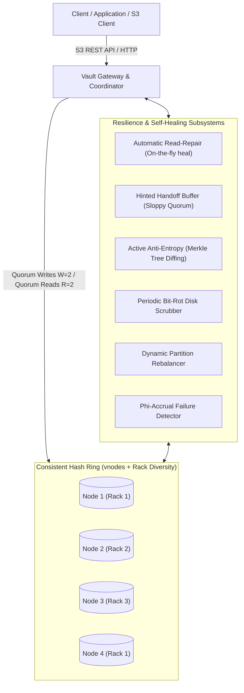

# Vault: Fault-Tolerant Distributed Object Storage System

[](https://sumitanand-sketch.github.io/sumit/)
[](https://github.com/sumitanand-sketch/sumit/releases/tag/v1.0.0)
[](https://github.com/sumitanand-sketch/sumit)
[](https://github.com/sumitanand-sketch/sumit)

Vault is an enterprise-grade distributed object storage system designed to reliably store, replicate, retrieve, and automatically repair large volumes of data across unreliable, independently failing storage nodes.

---

### 🌐 Dedicated Repositories & Live Deployments (3 Separate Instances)

| Person / Instance | Dedicated GitHub Repository | Live Web Application Link | Cluster Topology & Region | Storage Namespace |
|---|---|---|---|---|
| **Person 1** (`Cluster Alpha`) | 📦 [**sumitanand-sketch/vault-person1**](https://github.com/sumitanand-sketch/vault-person1) | 🚀 [**vault-person1 Live Console**](https://sumitanand-sketch.github.io/vault-person1/) | 3 Nodes (`US-East / EU-Central`) | `user-person1` (50 GB) |
| **Person 2** (`Cluster Beta`) | 📦 [**sumitanand-sketch/vault-person2**](https://github.com/sumitanand-sketch/vault-person2) | 🚀 [**vault-person2 Live Console**](https://sumitanand-sketch.github.io/vault-person2/) | 3 Nodes (`AP-South / US-West`) | `user-person2` (100 GB) |
| **Person 3** (`Cluster Gamma`) | 📦 [**sumitanand-sketch/vault-person3**](https://github.com/sumitanand-sketch/vault-person3) | 🚀 [**vault-person3 Live Console**](https://sumitanand-sketch.github.io/vault-person3/) | 3 Nodes (`EU-West / AP-East`) | `user-person3` (250 GB) |
| **Master Hub** | 📦 [**sumitanand-sketch/sumit**](https://github.com/sumitanand-sketch/sumit) | 🌐 [**Central Switchboard**](https://sumitanand-sketch.github.io/sumit/) | Global Multi-Cluster Router | Multi-Tenant Root |

---

## 🌟 Key Architecture & Capabilities



### 1. Object Storage Core & Data Model
- **Chunking & Streaming Engine**: Large objects are partitioned into configurable chunk sizes (default 1MB) with cryptographic SHA-256 and CRC32 checksums per chunk and S3-compliant ETag generation.
- **Galois Field Reed-Solomon Erasure Coding**: Optional $K$ data shards + $M$ parity shards over $GF(2^8)$ to minimize storage overhead to $50\%$ while surviving multiple node failures.
- **Object Versioning**: Multi-version concurrency control with immutable chunk manifests and delete markers.
- **Atomic Disk Writes**: Local storage engine writes to staging files, executes `fsync`, and performs atomic renames to prevent partial/torn writes during crashes.

### 2. Topology & Consistent Hashing
- **Virtual Nodes (`vnodes`)**: 128 vnodes per physical node ensure uniform data distribution without hot spots.
- **Rack & Zone Awareness**: Placement algorithm distributes replicas across distinct physical racks and availability zones.
- **Dynamic Membership**: Supports seamless node additions and graceful decommissioning.

### 3. Fault Tolerance & High Availability
- **Configurable Quorum Policies**: Tunable replication factor ($N$), write quorum ($W$), and read quorum ($R$) guaranteeing strict consistency when $W + R > N$.
- **Sloppy Quorum & Hinted Handoff**: If primary nodes are offline or partitioned, writes are buffered as hints and automatically replayed once the target node recovers.
- **Phi-Accrual Failure Detector**: Continuously models heartbeat arrival intervals using normal distributions to detect failures without false positives caused by transient network spikes.
- **Network Partition Tolerance**: Gracefully handles network splits; majority partitions maintain write quorums while minority partitions reject inconsistent writes to prevent split-brain.

### 4. Integrity Verification & Self-Healing
- **Silent Data Corruption (Bit-Rot) Detection**: Cryptographic verification on every read ensures corrupted bytes are never served to clients.
- **Automatic Read-Repair**: When a read detects a corrupted or stale chunk on one replica, healthy bytes from peer replicas are transparently written back to heal the degraded node in real time.
- **Active Anti-Entropy (AAE) via Merkle Trees**: Periodically computes prefix Merkle trees across storage nodes to pinpoint out-of-sync keys in $O(\log K)$ time without costly bulk data transfers.
- **Background Disk Scrubber**: Continuously sweeps disk blocks, verifying checksums and invoking auto-repair when physical bit degradation occurs.
- **Background Dynamic Rebalancer**: Automatically migrates partitions and chunks when nodes join or leave.

---

## 🚀 Quick Start

### Installation
```bash
# Clone the repository
git clone https://github.com/sumitanand-sketch/sumit.git
cd sumit

# Install dependencies and Vault in editable mode
pip install -e .
```

### Run Full Test Suite
```bash
python -m pytest -v
```
Output:
```
============================= test session starts =============================
collected 20 items

tests/test_bitrot_and_scrubbing.py::test_scrubber_detection_and_repair PASSED
tests/test_concurrency_and_multipart.py::test_concurrent_writes_and_reads PASSED
tests/test_concurrency_and_multipart.py::test_phi_accrual_detector PASSED
tests/test_fault_tolerance_chaos.py::test_majority_partition_continues_minority_fails PASSED
tests/test_hash_ring.py::test_consistent_hash_ring_preference_list PASSED
tests/test_hash_ring.py::test_rack_diversity PASSED
tests/test_hash_ring.py::test_dynamic_node_removal PASSED
tests/test_hinted_handoff.py::test_hinted_handoff_lifecycle PASSED
tests/test_merkle_anti_entropy.py::test_merkle_tree_identical PASSED
tests/test_merkle_anti_entropy.py::test_merkle_tree_diffing PASSED
tests/test_merkle_anti_entropy.py::test_active_anti_entropy_healing PASSED
tests/test_quorum_operations.py::test_quorum_write_and_read PASSED
tests/test_quorum_operations.py::test_multi_chunk_large_object PASSED
tests/test_quorum_operations.py::test_object_versioning PASSED
tests/test_read_repair.py::test_automatic_read_repair_on_bitrot PASSED
tests/test_rebalancing.py::test_dynamic_rebalance_on_node_join PASSED
tests/test_s3_gateway_api.py::test_s3_rest_api_lifecycle PASSED
tests/test_storage_engine.py::test_atomic_write_and_read PASSED
tests/test_storage_engine.py::test_bitrot_corruption_detection PASSED
tests/test_storage_engine.py::test_delete_chunk PASSED

============================= 20 passed in 2.70s ==============================
```

---

## 🧪 Interactive Chaos Demonstration

Run the automated chaos and self-healing lifecycle simulation:
```bash
python scripts/demo_chaos.py
```
This script exercises:
1. Multi-node cluster initialization with 128 vnodes per node.
2. Quorum write with ETag verification.
3. Silent bit-rot injection on physical disk.
4. Automatic Read-Repair detection and on-the-fly disk healing.
5. Simulated node crash and sloppy quorum hinted handoff.
6. Node recovery and automatic replay of pending hints.
7. Active Anti-Entropy Merkle Tree verification.
8. Dynamic node addition and partition rebalancing.

---

## 🌐 Launching the Local Cluster & Web Dashboard

Launch the cluster gateway with 3 storage nodes and the embedded Web Dashboard:
```bash
python -m vault.cli serve --port 8000 --nodes 3
```
*(Or double-click `start.bat` on Windows / `./start.sh` on Linux)*

Open your browser to:
👉 **`http://127.0.0.1:8000/dashboard`**

---

## 🛠️ Command-Line Interface (`vault`)

```bash
# Check cluster status and node topology
python -m vault.cli status

# Upload an object
python -m vault.cli put <bucket> <key> "payload string or data"

# Download an object
python -m vault.cli get <bucket> <key>

# Chaos: Simulate node crash
python -m vault.cli chaos fail --node-id node-1

# Chaos: Recover node and replay hints
python -m vault.cli chaos recover --node-id node-1

# Chaos: Isolate node via network partition
python -m vault.cli chaos partition --node-id node-2

# Chaos: Heal all partitions
python -m vault.cli chaos heal
```

---

## 📡 S3 REST API Endpoints

| Method | Endpoint | Description |
|---|---|---|
| `GET` | `/api/buckets` or `/` | List all buckets |
| `PUT` | `/{bucket}` | Create bucket (supports custom replication policy headers) |
| `DELETE` | `/{bucket}` | Delete empty bucket |
| `GET` | `/{bucket}` | List objects (supports `prefix`, `delimiter`, `marker`, `max_keys`) |
| `PUT` | `/{bucket}/{key:path}` | Upload object with metadata and streaming chunks |
| `GET` | `/{bucket}/{key:path}` | Download object with versioning and range request support |
| `HEAD` | `/{bucket}/{key:path}` | Query object metadata, ETag, and size |
| `DELETE`| `/{bucket}/{key:path}` | Place delete marker or remove object version |
| `GET` | `/api/cluster/status` | Cluster telemetry, node health, and storage usage |
| `POST`| `/api/chaos/node/fail` | Inject node crash |
| `POST`| `/api/chaos/node/recover`| Restore failed node |
| `POST`| `/api/chaos/partition` | Create simulated network partition |
| `POST`| `/api/chaos/heal` | Heal network partition |
| `POST`| `/api/admin/anti-entropy`| Trigger Merkle tree active anti-entropy sync |
| `POST`| `/api/admin/scrub` | Trigger bit-rot disk scrubber |
| `POST`| `/api/admin/rebalance` | Trigger partition rebalancing for a new node |

---

## 🐳 Docker & Docker-Compose Deployment

```bash
# Build and run containerized Vault cluster
docker-compose up -d

# Check cluster logs
docker-compose logs -f

# Stop cluster
docker-compose down
```